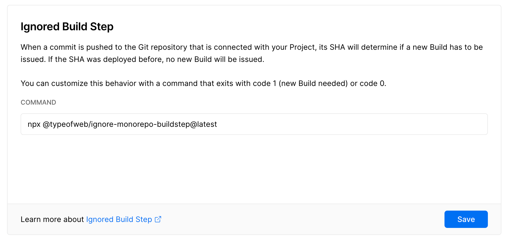
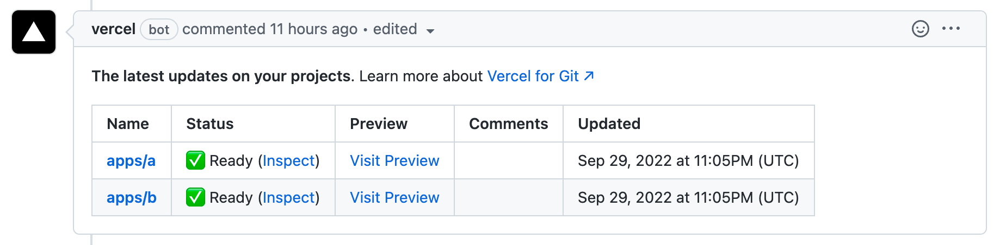
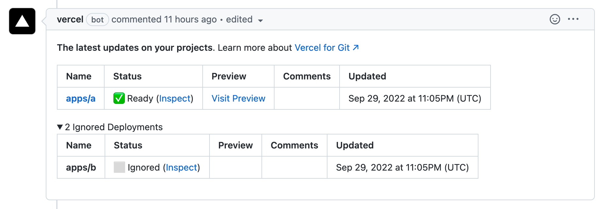
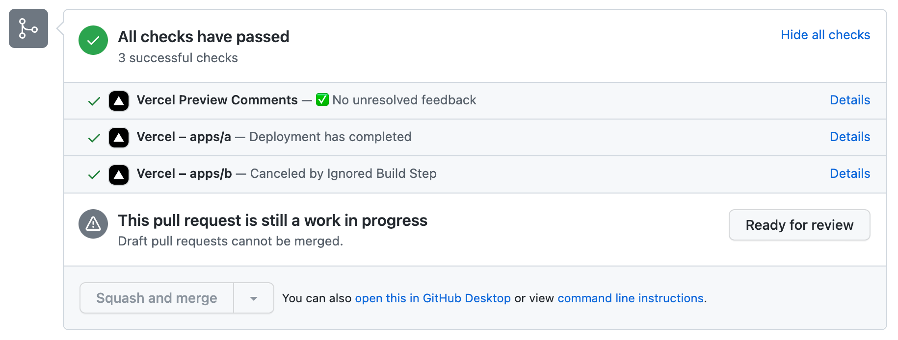

# @typeofweb/ignore-monorepo-buildstep

A package that adds monorepo support for Vercel's "Ignore build-step" setting. Small, fast, with 0 external dependencies.

## The problem
By default, when working in a monorepo, each push triggers Vercel to rebuild all the projects even when changes were introduced only to some of them. It takes time and blocks the build pipeline for your team. Thanks to `@typeofweb/ignore-monorepo-buildstep`, this is no longer a problem – Vercel becomes smarter and only rebuilds what needs building!

`@typeofweb/ignore-monorepo-buildstep` helps you save time and money.

## Example setup

### Repo structure

Assume we're using [pnpm workspaces](https://pnpm.io/workspaces) and we have the following monorepo structure:

```
.
├── apps
│   ├── a
│   └── b
└── packages
    ├── common
    └── depA
```

Apps `a` and `b` both depend on the `common` package. Moreover, app `a` depends on `depA` package.

### Vercel config

Add the following command to the "Ignore Build Step" section in your Vercel project settings:

```
npx @typeofweb/ignore-monorepo-buildstep
```



### Result

When any changes are introduced to `packages/common`, both apps `a` and `b` will be built:


However, when `packages/depA` is modified, only `apps/a` is built while `apps/b` is skipped:


Moreover, deployment statuses are reported as successful even when builds are skipped:


## How does it work?

`@typeofweb/ignore-monorepo-buildstep` analyses the structure of the monorepo. It reads `pnpm-workspace.yaml` and `package.json` of every package, and creates a tree of dependencies inside the monorepo.

Then, it proceeds to check whether the given package or any of its dependencies were modified since the last commit with the use of `git diff "HEAD^" "HEAD" --quiet`.

Currently, only `pnpm` workspaces are supported but more is on the roadmap.
